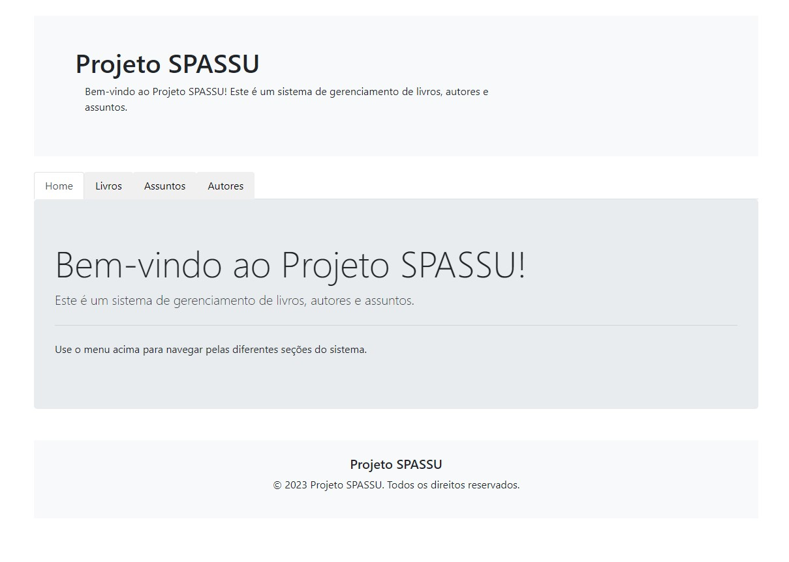
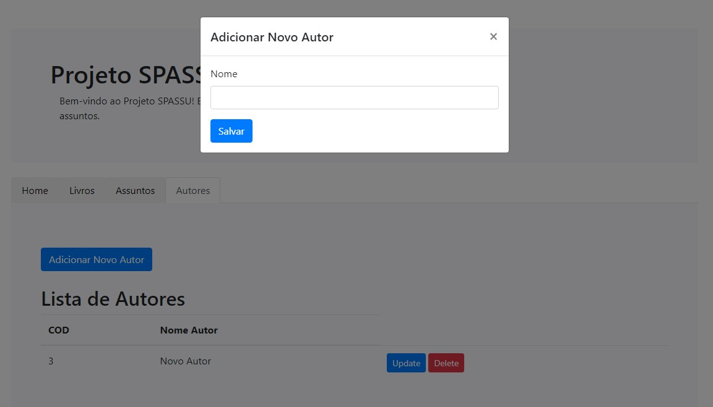
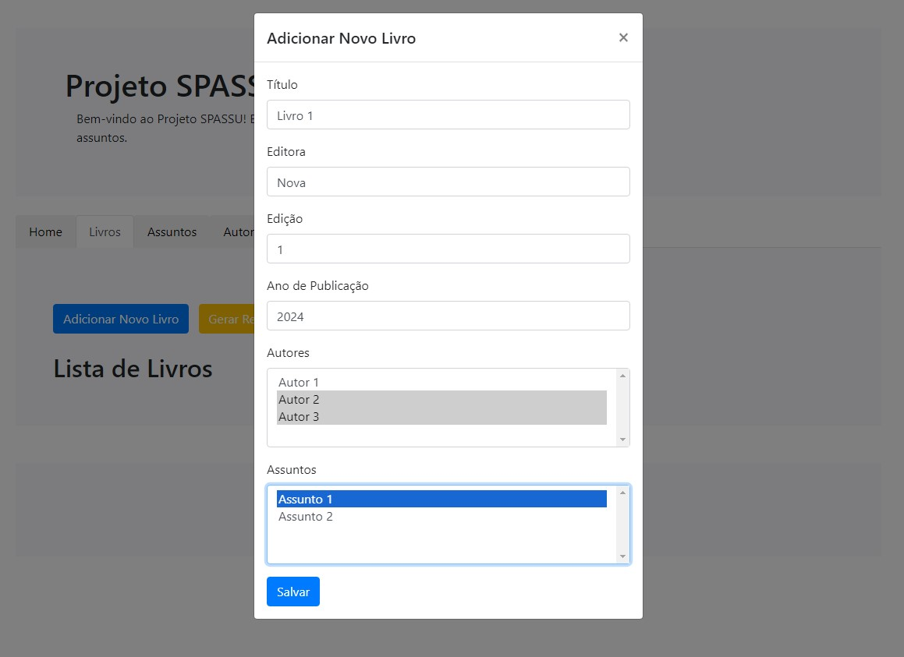
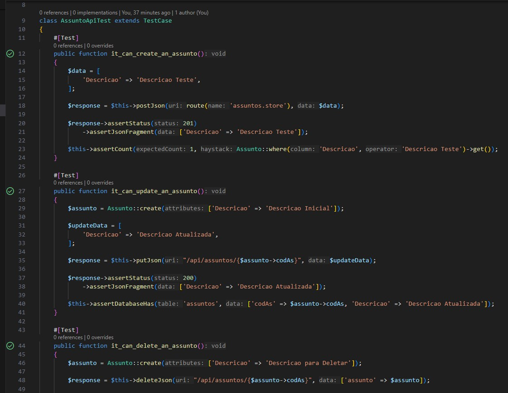
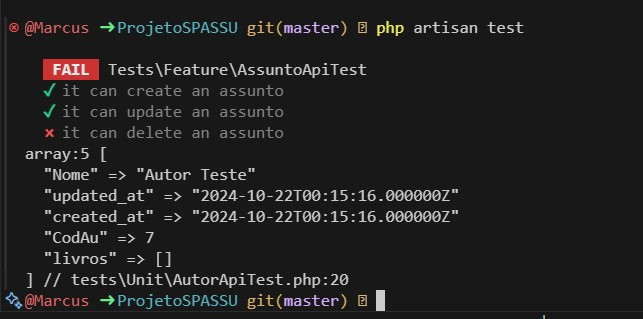

<p align="center"></p>

## Sobre o projeto

Esse projeto é um sistema de gerenciamento de livros, autores e assuntos. Seu intuito é demonstrar conhecimento em tecnologias específicas e padrões de projeto.

## Arquitetura

Com o intuito de separarmos o backend do frontend, foi feito um esquema de APIs com Laravel e MySQL e para consumo no frontend usamos AJAX feito em JavaScript, Bootstrap em conjunto com o motor de template do Laravel chamado Blade.

## Estrutura do Banco de Dados

Para seguirmos fielmente o modelo de banco de dados que foi proposto, usamos o banco relacional MySQL, onde criamos 3 tabelas principais chamadas Livro, Assunto e Autor. Além dessas tabelas, temos algumas tabelas associativas chamadas livro_autor (usada para relacionar a tabela de livros e autores) e livro_assunto (usada para relacionar a tabela de livros e assuntos), já que temos um relacionamento de muitos para muitos entre as entidades. Segue o SQL do banco de dados:

```sql
USE spassu;

-- Tabela Livro
CREATE TABLE Livro (
    cod INT AUTO_INCREMENT PRIMARY KEY,
    Titulo VARCHAR(40) NOT NULL,
    Editora VARCHAR(40) NOT NULL,
    Edicao INT NOT NULL,
    AnoPublicacao VARCHAR(40) NOT NULL
);

-- Tabela Autor
CREATE TABLE Autor (
    CodAu INT AUTO_INCREMENT PRIMARY KEY,
    Nome VARCHAR(40) NOT NULL
);

-- Tabela Assunto
CREATE TABLE Assunto (
    codAs INT AUTO_INCREMENT PRIMARY KEY,
    Descricao VARCHAR(20) NOT NULL
);

-- Tabela Livro_Autor
CREATE TABLE Livro_Autor (
    Livro_cod INT,
    Autor_cod INT,
    FOREIGN KEY (Livro_cod) REFERENCES Livro(cod),
    FOREIGN KEY (Autor_cod) REFERENCES Autor(CodAu),
    PRIMARY KEY (Livro_cod, Autor_cod)
);

-- Tabela Livro_Assunto
CREATE TABLE Livro_Assunto (
    Livro_cod INT,
    Assunto_cod INT,
    FOREIGN KEY (Livro_cod) REFERENCES Livro(cod),
    FOREIGN KEY (Assunto_cod) REFERENCES Assunto(codAs),
    PRIMARY KEY (Livro_cod, Assunto_cod)
);
```
## Mostrando o projeto
Em cada aba, podemos visualizar, criar, editar e excluir as entidades e suas possíveis relações com as outras entidades.

<p align="center"></p>
Usamos o modal do Bootstrap para incluir nosso formulário e realizar as requisições.

Veja a seguir que no cadastro de livros, já trazemos as entidades de assuntos e autores nos selects finais, onde podemos selecionar um ou mais de cada.

<p align="center"></p>

## Relatório

Para o relatório, foi criada uma view no banco de dados, onde agregamos os livros pelos autores e chamamos a mesma através de uma rota no Laravel. Basta clicar no botão GERAR RELATÓRIO na aba de livros e a mágica acontece. A tecnologia utilizada para a mesma foi a biblioteca DomPDF. Segue o SQL da view criada:

```sql
CREATE VIEW vw_LivrosPorAutor AS
SELECT 
    a.Nome AS Autor,
    l.Titulo AS Livro,
    l.Editora,
    l.Edicao,
    l.AnoPublicacao,
    GROUP_CONCAT(DISTINCT s.Descricao ORDER BY s.Descricao SEPARATOR ', ') AS Assuntos
FROM 
    Livro l
JOIN 
    Livro_Autor la ON l.cod = la.Livro_cod
JOIN 
    Autor a ON la.Autor_cod = a.CodAu
LEFT JOIN 
    Livro_Assunto las ON l.cod = las.Livro_cod
LEFT JOIN 
    Assunto s ON las.Assunto_cod = s.codAs
GROUP BY 
    a.Nome, l.Titulo, l.Editora, l.Edicao, l.AnoPublicacao;
```

## Testes Automatizados

Para os testes automatizados, usamos o PHPUnit e os testes estão localizados na pasta tests/Unit. Inicialmente, criamos apenas testes de API, ou seja, temos testes de amostra, inserção, atualização e deleção das entidades. Segue exemplo do AssuntoApiTest:

<p align="center"></p>
Perceba que o VSCode nos mostra um check ao lado de cada teste, isso significa que o resultado esperado foi obtido da API. Caso venha a falhar, é mostrado um ícone de falha vermelho. O VSCode também nos permite realizar cada teste clicando nesses ícones sem precisar rodar qualquer comando. Mas caso precisemos rodar o comando de cada teste, podemos usar os comandos do PHPUnit. Segue exemplo para rodarmos os métodos da API de Assunto:

- php artisan test --filter it_can_create_an_assunto (CRIAÇÃO)
- php artisan test --filter it_can_update_an_assunto (ATUALIZAÇÃO)
- php artisan test --filter it_can_delete_an_assunto (DELEÇÃO)

Ou podemos simplesmente rodar:

- php artisan test

E ele rodará todos os testes da classe.

<p align="center"></p>
Perceba que recebemos dois "checks" verdes e um vermelho. Propositalmente deixamos a deleção falhar. Atente-se ao teste, pois não significa que a deleção em si falhou, mas sim a resposta esperada pelo teste. Nesse caso, como temos mais de um assunto com o mesmo título, estamos esperando a resposta de apenas um título e o mesmo está nos trazendo mais de um, o que faz com que nosso teste falhe de certa forma.

## Rodando o Projeto

Para rodar o projeto, deixei arquivos do Docker preconfigurados no projeto. Ou seja, com o Docker instalado e inicializado, basta clonar o projeto seguir os seguintes passos:

- docker-compose up --build
- docker-compose exec app php artisan migrate (para migrar as tabelas do banco de dados)

Caso não possua Docker ou tenha alguma dificuldade, podemos usar o servidor do próprio Laravel:

- php artisan serve
- npm run dev (para rodar o Vite, que é uma ferramenta de construção de frontend usada para compilar e empacotar arquivos de frontend, como JavaScript. Sem ele, nosso AJAX não funciona)
Configurar manualmente o banco de dados no arquivo .env
- Rodar o migrate com o comando: php artisan migrate

## Conclusão

Este projeto de gerenciamento de livros, autores e assuntos demonstra a aplicação de diversas tecnologias e padrões de projeto para criar uma solução robusta e escalável. Utilizando Laravel para o backend, MySQL para o banco de dados e AJAX com JavaScript e Bootstrap para o frontend, conseguimos criar uma aplicação eficiente e de fácil manutenção.

A arquitetura baseada em APIs permite uma clara separação entre o frontend e o backend, facilitando futuras expansões e integrações. A utilização do Blade como motor de templates do Laravel proporciona uma maneira simples e eficaz de gerenciar as views, enquanto o Vite melhora a experiência de desenvolvimento de frontend com sua rápida compilação e recarregamento instantâneo.

Os testes automatizados com PHPUnit garantem a confiabilidade e a estabilidade do sistema, permitindo identificar e corrigir problemas de forma rápida e eficiente. A inclusão de testes de criação, atualização e deleção para as entidades principais assegura que todas as funcionalidades críticas estejam cobertas.

Por fim, a configuração do Docker simplifica o processo de setup e deployment, tornando mais fácil para outros desenvolvedores contribuírem com o projeto e para a aplicação ser executada em diferentes ambientes.

Esperamos que este projeto sirva como uma base sólida para futuras implementações e inspire boas práticas de desenvolvimento de software. Agradecemos por conferir nosso trabalho e estamos abertos a sugestões e colaborações para melhorar ainda mais esta aplicação.